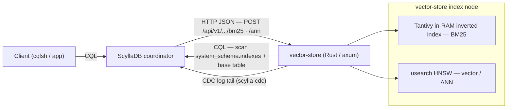

# ScyllaDB Full-Text Search

A CQL demo — BM25 full-text & vector search

---

## Slide 1 — What is FTS (vs. `LIKE`)?

- **FTS** tokenizes and analyzes text (lowercase, stop-word removal, punctuation split) into an **inverted index**, then ranks hits by **BM25 relevance** — best matches first, not row order.
- **`LIKE`** is a raw substring/pattern scan: no tokenization, no ranking, every match is "equal", and it gets slow at scale.
- FTS speaks a query language — `AND` / `OR` / `NOT`, `"exact phrases"`, `(grouping)` — while `LIKE` only offers `%` / `_` wildcards.
- Trade-off: `LIKE` is exact and always current; FTS is ranked and language-aware but **eventually consistent** (index built from CDC). *No stemming in M1: `run` ≠ `running`.*

---

## Slide 2 — The demo: CQL I'll run

- **One table, one index** — text column `message` + a custom index; creating it auto-enables CDC, then wait for `SERVING`:
  ```sql
  CREATE CUSTOM INDEX messages_body_fts ON chat.messages(message) USING 'fulltext_index';
  ```
- **The only valid FTS query shape** (term must be identical in both clauses):
  ```sql
  SELECT ... FROM messages WHERE BM25(message,'scylladb') > 0
  ORDER BY BM25(message,'scylladb') LIMIT 10;
  ```
- **Works natively (M1):** global search, `"exact phrase"`, BM25 ranking, `AND`/`OR`/`NOT` + grouping, case-folding, stop-words, punctuation tokenization.
- **Fails live on purpose (roadmap):** `LIMIT` mandatory (≤1000), no extra `WHERE` filter, `BM25()` not allowed in `SELECT` — the M2/M3 files prove the gaps with real server errors.

---

## Slide 3 — Architecture: ScyllaDB ↔ vector-store



- **ScyllaDB owns** CQL parse/execute, base data, CDC, and index **metadata only** — it stores *no* inverted or vector index.
- **vector-store owns the index**: a Rust/axum sidecar that connects back as a CQL client, discovers `CUSTOM` indexes, bootstraps via full table scan, then tails **CDC** to stay current (<3s lag).
- **Query path:** coordinator calls `POST .../bm25`, gets ranked primary keys, then **re-reads authoritative rows from the base table** in rank order (503 until `SERVING`).

---

## Slide 4 — Future milestones

- **M2 — filtered & scoped FTS:** allow extra `WHERE` beside BM25 — filter by `sender_id`, scope to a `chat_id`, date ranges (the queries that fail today).
- **M2 — hybrid search:** combine BM25 + vector ANN in one query, fused with `USING FUSION = {RRF | WEIGHTED}`.
- **M3 — richer matching:** enable fuzzy (`term~N`) and prefix/wildcard (`term*`) — already parsed by Tantivy, not yet served.
- **Hardening:** per-language analyzers & stemming, index durability / faster rebuild (today in-RAM, rebuilt on restart), and read-after-write consistency.
