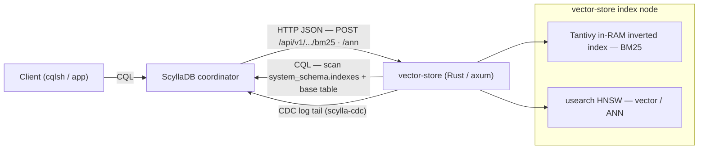

# ScyllaDB Full-Text Search

BM25 full-text search in CQL — **Problem · Solution · Syntax · Demo**

---

## Problem

1. **Two systems, plus a pipeline between them** — a modern data pipeline needs a database *and* a
   search engine. Customers run both, and they must also build a pipeline to copy the data and keep
   it up to date.

2. **ScyllaDB is only half ready for RAG and agentic AI** — it already has vector search, but vector
   search misses exact words like error codes. The text search we have today needs `ALLOW FILTERING`,
   so it reads every row, and it gives no relevance ranking.

> **So we need** keyword search with ranking — inside the database, next to vector search, in CQL.

---

# Part 2 — Solution

---

## Native BM25 full-text index in CQL

- One CQL statement makes a text column searchable. It builds an inverted index with BM25 ranking — you need **no separate search engine, and no second write**:
  ```sql
  CREATE CUSTOM INDEX articles_body_fts ON articles(article) USING 'fulltext_index';
  ```
- Creating the index turns on CDC automatically. First it reads the whole table. Then it follows the CDC log to stay up to date (about 3 seconds behind). **The application writes to ScyllaDB only** — the server does the indexing.
- Queries are normal CQL — `BM25()` in `WHERE` and `ORDER BY`. Your current drivers, tools and `cqlsh` keep working. There is no second endpoint and no second client library.
- The same component already serves **vector search**, so keyword search and vector search share one cluster to run. This is the base for hybrid search (M2).
- **You get ranked results, not a scan**: the query returns the best `LIMIT n` rows. The cost depends on how many rows you ask for, not on how many rows you store.

---

## Architecture: ScyllaDB ↔ vector-store


```mermaid
flowchart LR
  App["Client (cqlsh / app)"] -->|CQL| Coord["ScyllaDB coordinator"]
  Coord -->|"HTTP JSON — POST /api/v1/.../bm25 · /ann"| VS["vector-store (Rust / axum)"]
  VS -->|"CQL — scan system_schema.indexes + base table"| Coord
  VS -->|"CDC log tail (scylla-cdc)"| Coord
  subgraph node["vector-store index node"]
    Tantivy["Tantivy in-RAM inverted index — BM25"]
    USearch["usearch HNSW — vector / ANN"]
  end
  VS --> Tantivy
  VS --> USearch
```

- **ScyllaDB holds** the data, runs the CQL queries, writes the CDC log, and keeps the index **metadata only**. It does *not* store the inverted index or the vector index.
- **vector-store holds the index.** It is a separate service in Rust. It connects back to ScyllaDB as a normal CQL client and finds the `CUSTOM` indexes. First it reads the whole table. Then it follows the CDC log to stay up to date.
- **How a query works:** ScyllaDB calls `POST .../bm25` and gets back the primary keys in rank order. It then **reads the real rows from the table** in that order, so you always see current data. Before the index reports `SERVING`, you get a 503 error.

---

## Relevance: how BM25 ranks

```text
score(D,Q) = Σ_t∈Q  IDF(t) · tf(t,D)·(k1+1) / ( tf(t,D) + k1·(1 − b + b·|D|/avgdl) )
```

- **Term frequency (TF)** — if a word appears more often, the score is higher. But the score grows more and more slowly (`k1` ≈ 1.2): the 10th time adds much less than the 1st. So repeating a word many times does not help much.
- **Inverse document frequency (IDF)** — words that are rare in the whole collection count more. A word that appears in almost every row counts almost nothing. This is why `E1102` ranks above `error`.
- **Document length** — a match in a short document counts more than the same match in a long one. `b` ≈ 0.75 controls how strong this effect is, compared to the average document length (`avgdl`).
- **Several words in one query** — BM25 adds the score of each word. Word order and distance do not matter. Only words in quotes must appear together. Tantivy uses the normal defaults `k1 = 1.2`, `b = 0.75`.

---

## What the solution covers today

- **Works today (M1):** search the whole indexed column, `"exact phrase"`, BM25 ranking, `AND` / `OR` / `NOT` with grouping, upper and lower case treated the same, English stop words, and splitting on punctuation.
- **What does not work yet** (shown live in the demo):
  - `LIMIT` is required and must be `<= 1000`.
  - You cannot add another `WHERE` next to `BM25()`.
  - You cannot put `BM25()` in the `SELECT` list.
  - **No stemming** — `run` does not match `running`.
  - Eventually consistent — new rows appear after about 3 seconds.
- **M2 — search with a filter:** allow another `WHERE` next to BM25 — by `author`, for one id, or for a date range.
- **M2 — hybrid search:** BM25 and vector search in one query, combined with `USING FUSION = {RRF | WEIGHTED}`. This gives RAG both exact matching and similar meaning.
- **M3 — more match types:** fuzzy (`term~N`) and prefix (`term*`). Tantivy already reads them, but the server does not answer them yet.
- **Later improvements:** analyzers and stemming for each language; a durable index that rebuilds faster (today it is in memory and is rebuilt after a restart); and read-after-write consistency.

---

# Part 3 — Syntax

---

## The FTS query shape

- This is the **only** shape that works. The search text must be **exactly the same** in `WHERE` and in `ORDER BY`:
  ```sql
  SELECT article FROM articles
  WHERE BM25(article, 'photosynthesis') > 0
  ORDER BY BM25(article, 'photosynthesis')
  LIMIT 10;
  ```
- What you can write in the search text (Tantivy reads it): single words, `AND` / `OR` / `NOT`, `"exact phrases"`, and `(grouping)`.
- The rules. If you break one, the server returns an `InvalidRequest` error:
  - `LIMIT` is **required** and must be `<= 1000`.
  - The search text must be the same in `WHERE` and in `ORDER BY`.
  - **You cannot add another `WHERE` condition** — not on the partition key, not on the clustering key, not on a secondary index.
  - The value after `>` is always `0`. It only means "give me every match" — you cannot use it to set a minimum score.
  - `BM25(...)` **cannot appear in the `SELECT` list**.
- To create the index: `CREATE CUSTOM INDEX <name> ON <table>(<text_col>) USING 'fulltext_index';` — it works on `text`, `varchar` and `ascii` columns only.

---

# Part 4 — Demo

---

## What I'll run

- **Setup** — keyspace `blog`, table `articles(article_id, title, author, article)`, 21 short articles, then the fulltext index. Wait for `SERVING`.
- **`demo-m1.md` — what works today:** search for a word, `"exact phrase"`, BM25 ranking (a rare word ranks above a common one), `AND` / `OR` / `NOT` with grouping, and how the analyzer works (case, stop words, punctuation).
- **`demo-m2.md` — refused today:** filter by `author` next to BM25, and search inside one `article_id`. Both fail with *"Full-text search queries do not support additional WHERE restrictions"*.
- **`demo-m3.md` — read, but not answered:** `reletivity~1` (fuzzy) and `photo*` (prefix). The server accepts them but returns nothing.
- **`demo-errors.md` — the rules, live:** a score value other than `0`, missing `ORDER BY`, missing `WHERE`, different search text in the two clauses, missing `LIMIT` or `LIMIT` too large, and `BM25()` in the `SELECT` list.

---

## Backing notes — why an index cannot help `LIKE`

- When you index a column, that column becomes the **partition key** of a hidden index table
  (`create_index_statement.cc:151`). Partition keys are hashed, so you can only look up a complete
  value. Hashing also removes the order, so `LIKE 'rel%'` cannot work either.
- ScyllaDB only uses an index for `=`, and for `CONTAINS` on collections
  (`secondary_index_manager.cc:42-70`). It rejects every other operator.
- This is why `LIKE` is in `needs_filtering()` (`statement_restrictions.cc:100-103`). It follows from
  the two points above — it is not a separate rule.
- An inverted index is different: it uses **each word** as a key, so `relativity` is something you
  can look up. Whole value as key, or each word as key — that is the real difference.
- What does help today: `WHERE author = 'John Smith' AND article LIKE '%relativity%' ALLOW FILTERING`.
  The index answers `author =`, and `LIKE` then checks only those rows.
